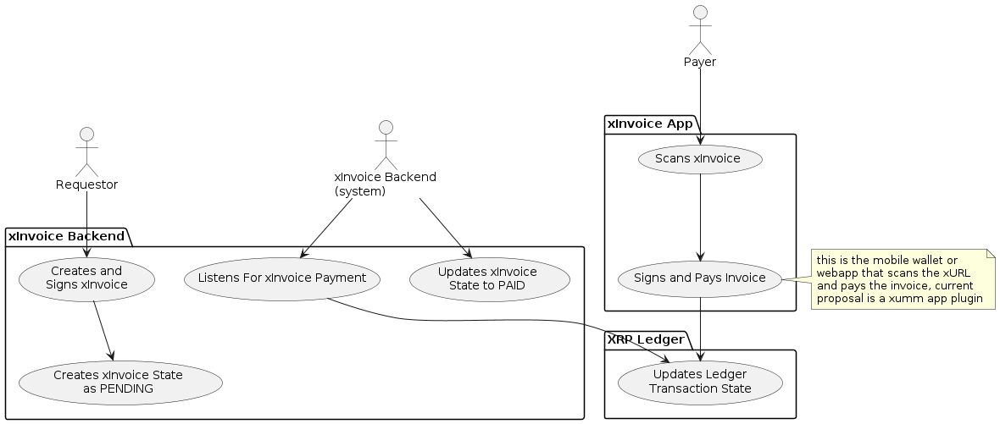
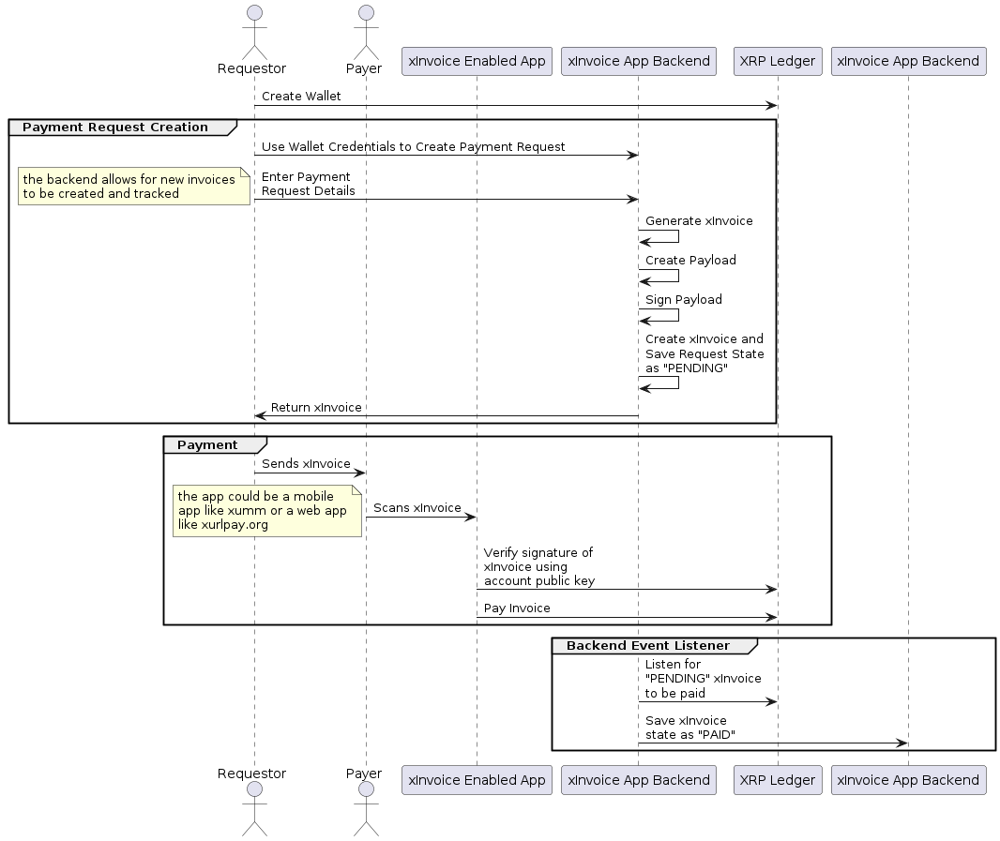
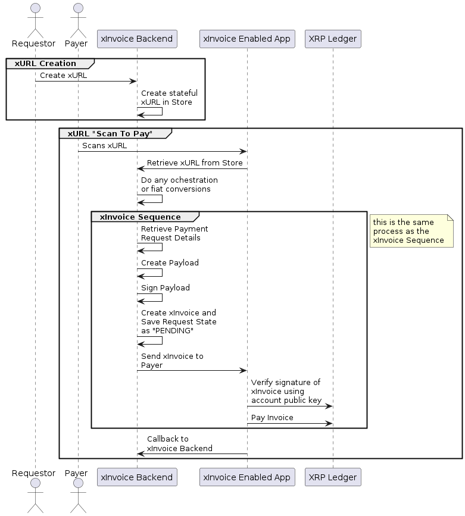

# xInvoice and xURL Protocols

**IMPORTANT: THIS IS A WORK IN PROGRESS. IT IS INTENDED TO BE PRESENTED TO THE XRP COMMUNITY FOR REVIEW**

## Introduction
Making a payment is a common task for any business, and making payment easy for users is a key goal for any payment network. The key challenge is to make the payment process as easy as possible for all users in the ecosystem on both sides of the transaction. xInvoice and xURL are two protocols intended for the XRP payment ecosystem that aim to make the payment process as easy as possible for all users by abstracting and separating the activities of creating payment requests and automating the generation of payment requests using a backend. *It is primarily intended for use by XRP payment networks and XRP payment users using QR codes to initiate payment, but does not necessarily require the use of scanning technologies to be applied.*

* **xInvoice** is a protocol for creating payment requests. It is intended to be used by XRP payment users and XRP payment networks. It enables for a payer to verify the authenticity of a payment request has the ability to expire. The requestor can track and manage the lifecycle of the payment request using a backend.
* **xURL** is a protocol for creating xInvoice payment requests using backend automation. It is intended to be used by XRP payment users and XRP payment networks. It enables a payer to generate an xInvoice payment request "on demand" at any time by using callbacks to the backend generating the payment request. The requestor can track and manage the lifecycle of the payment request using a backend.

## Use Cases

### Scan To Pay
"Scan to Pay" is a use case for the xURL protocol. It is a way for users to automate the creation of an xInvoice using a backend. This allows the seller to create a QR code that can be scanned by the buyer to create a payment request at the time of purchase. 


Merchants can have a new customer driven payment experience with little to no POS overhead because it is payer-driven, and can be verified on the payer wallet with little or no POS interaction.

### On Demand Fulfillment
"On Demand Fulfillment"  is a way for merchants to create a payment request that can be fulfilled by the buyer at the time of scan, and can be converted from fiat at the time of payment. These can be used over and over by the buyer to receive goods and trigger backend fulfillment. This is ideal for B2B restocking or rental use cases.


### Asymmetric Payment Technologies
"Asymmetric Payment Technologies" is a way for merchants to create a payment request in a printed form that can be fulfilled by the buyer at the time of scan, and doesn't require that the seller have a smart device to accept payment. Since the buyer is initiating payment, and that payment can be verified on the buyer's wallet, this can be used when the seller may not have direct access to a mobile device or computer.


# xInvoice
xInvoice is simply put a payment request made by a wallet that asks the payer for a specific amount of XRP to be sent to a specific address, and is signed by the requesting wallet so it can be guaranteed as coming from the correct requesting address. The payment request is a JSON object that contains the following fields:


```
{
    "amount": 11.2,
    "memo": "its for the kids",
    "expires: 1661724153336054
}
```

and the xInvoice application generates the payload:

```
{
	"body": {
		"address": "rnfkHxFH3QTsrwYbyDLPS7gt6GNxEwmbai",
		"amount": 11.2,
		"expires": 1661727650.907614,
		"memo": "its for the kids",
		"public_key": "ED06F449929015B8FD9242603D2755B39786D4A378F89D9B154D0BA228DE05B2ED",
		"request_hash": "mVxmXaETu6eFggTxX9TcnM"
	},
	"payment_request": "eyJhbW91bnQiOiAxMS4yLCAicHVibGljX2tleSI6ICJFRDA2RjQ0OTkyOTAxNUI4RkQ5MjQyNjAzRDI3NTVCMzk3ODZENEEzNzhGODlEOUIxNTREMEJBMjI4REUwNUIyRUQiLCAiYWRkcmVzcyI6ICJybmZrSHhGSDNRVHNyd1lieURMUFM3Z3Q2R054RXdtYmFpIiwgImV4cGlyZXMiOiAxNjYxNzI3NjUwLjkwNzYxNCwgIm1lbW8iOiAiaXRzIGZvciB0aGUga2lkcyBtYW4iLCAicmVxdWVzdF9oYXNoIjogIm1WeG1YYUVUdTZlRmdnVHhYOVRjbk0ifQ==:VBa3MLl6kF3qTqMqQj+wDPNyOq9f2XY3UD7n+En/fRHbCrpBxMbLbRv8L3OiMNr/NYklSwT+TOgzSphKQSV+DA=="
}
```

The `payment_request` response, intended to be encoded into the scanned QR code has two parts:

1. The payload (`body`) with all the information needed for the payment to be fulfilled by the buyer.
2. The signature (`signature`) of the payload that is used to verify the authenticity of the payload.

This is represented as to base64 encoded strings with a (`:`) separator.

`eyJhbW91bnQiOiAxMS4yLCAicHVibGljX2tleSI6ICJFRDA2RjQ0OTkyOTAxNUI4RkQ5MjQyNjAzRDI3NTVCMzk3ODZENEEzNzhGODlEOUIxNTREMEJBMjI4REUwNUIyRUQiLCAiYWRkcmVzcyI6ICJybmZrSHhGSDNRVHNyd1lieURMUFM3Z3Q2R054RXdtYmFpIiwgImV4cGlyZXMiOiAxNjYxNzI3NjUwLjkwNzYxNCwgIm1lbW8iOiAiaXRzIGZvciB0aGUga2lkcyBtYW4iLCAicmVxdWVzdF9oYXNoIjogIm1WeG1YYUVUdTZlRmdnVHhYOVRjbk0ifQ==:VBa3MLl6kF3qTqMqQj+wDPNyOq9f2XY3UD7n+En/fRHbCrpBxMbLbRv8L3OiMNr/NYklSwT+TOgzSphKQSV+DA==`

## xInvoice Use Case Activities and Actors


## xInvoice Generation and Use Sequence


# xURL
Essentially xUrl extends the xInvoice protocol by adding a backend process to automate the generation of an xInvoice. The backend process is a simple HTTP server that accepts a POST request with the xInvoice payload and returns the xInvoice payload via a callback encoded into the xURL.

## xURL Use Case Activities and Actors


## xURL Generation and Use Sequence


