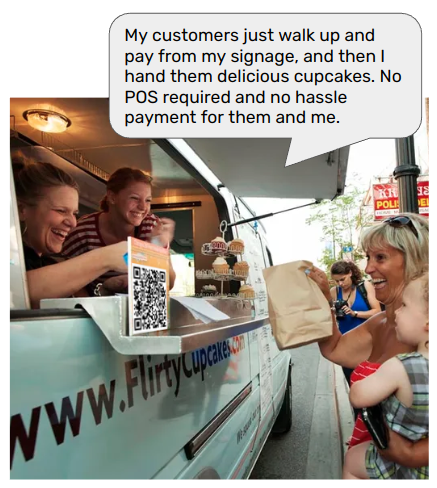
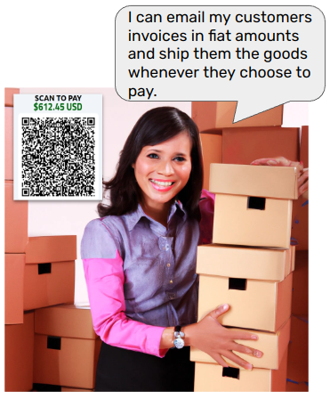
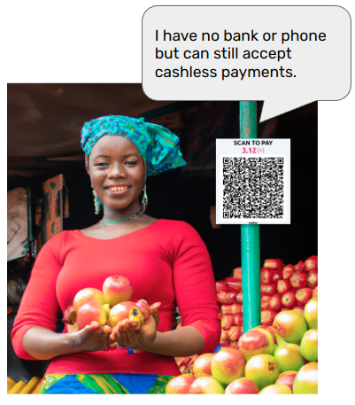
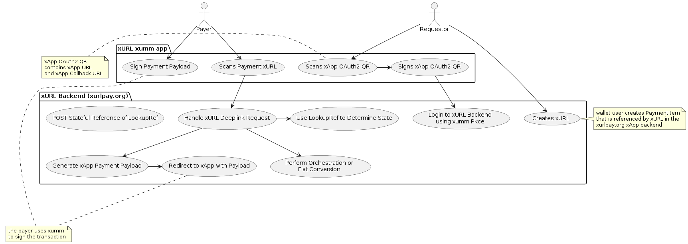

# xUrlPay.org and the xURL Protocol

**IMPORTANT: THIS IS A WORK IN PROGRESS. IT IS INTENDED TO BE PRESENTED TO THE XRP COMMUNITY FOR REVIEW**

## Introduction
Making a payment is a common task for all of us, and making payment easy for users is a key goal for any payment network. The key challenge is to make the payment process as easy as possible for all users in the ecosystem on both sides of the transaction. xUrlPay.org and the xURL protocol  are intended for the XRP payment ecosystem and aim to make the payment process as easy as possible for all users and create the possibilities for new UX use cases. 

By abstracting and separating the activities of creating payment requests and automating the generation of payment requests using a backend. *It is primarily intended for use by XRP payment networks using the xumm wallet and XRP payment users using QR codes to initiate payment, but does not necessarily require the use of scanning technologies to be applied.*

* **xURL** is a protocol and specification for creating durable payment requests via signed URLs that become xumm payloads and can trigger backend automation. 

* **xUrlPay.org** is an backend application for creating and hadling durable payment requests backed by metadata. It is intended to be used by XRP payment users and XRP payment networks and generates xApp payloads and can trigger automation. The requestor can track and manage the lifecycle of the payment request using a backend.
  

## Use Cases

### Scan To Pay
"Scan to Pay" is a use case for the xURL protocol. It is a way for users to automate the creation of an xInvoice using a backend. This allows the seller to create a QR code that can be scanned by the buyer to create a payment request at the time of purchase. 



Merchants can have a new customer driven payment experience with little to no POS overhead because it is payer-driven, and can be verified on the payer wallet with little or no POS interaction.

### On Demand Fulfillment
"On Demand Fulfillment"  is a way for merchants to create a payment request that can be fulfilled by the buyer at the time of scan, and can be converted from fiat at the time of payment. These can be used over and over by the buyer to receive goods and trigger backend fulfillment. This is ideal for B2B restocking or rental use cases.



### Asymmetric Payment Technologies
"Asymmetric Payment Technologies" is a way for merchants to create a payment request in a printed form that can be fulfilled by the buyer at the time of scan, and doesn't require that the seller have a smart device to accept payment. Since the buyer is initiating payment, and that payment can be verified on the buyer's wallet, this can be used when the seller may not have direct access to a mobile device or computer.



# xURL
[XURL Spec](./xurlspec.md)

<!-- # xURL
xURLs are xApp deeplinks that allow for backend automation to create "just in time" payment payloads for xumm. xUrls have some core features. Whatever system is handling the request of an xURL must be aware of the fields in the metadata schema to generate a payload.

ie. 

`https://xumm.app/detect/xapp:sandbox.<xurlappId>?TransactionType=Payment&LookupType=PaymentItem&LookupRef=1&CustomMetadata.shipping_address=6310%20SE%20Toola%20Ln.%20Portland%20Or%2098701&NotificationType=slack&NotificationRef=myslackdomain.com#xumm_payments&sig=8C8410F51B7AA063E08EA1E76485254184A1E9A32E73411D==`


## xURL parts

* **TransactionType** - The type of transaction to create. ie. Payment, TrustSet, etc.

* **LookupType** - The type of lookup to use. ie. PaymentItem, PaymentRequest, etc.

* **LookupRef** - The reference to use for the lookup. can be a primary key for a database store or other unique reference.

* **CustomMetadata Payload Spec** - xUrls can contain parameters that can be be then appended to the `custom_meta:blob` section of a xumm payload.

```json
{
	"shipping_address": "6310 SE Toola Ln. Portland Or 98701",
}
```
* **Signature** - xUrls can be verified as being generated by a specific wallet's private key. This allows for the ability to verify the payload of an xURL as originating from the wallet that it is going to pay.

```python
def sign_message(message, private_key, encoding='utf-8'):
    """
    sign the message to be sent private_key: must be hex
    message: must be encoded using encoding
    """
    module = _ALGORITHM_TO_MODULE_MAP[CryptoAlgorithm.ED25519]
    message_bytes = message.encode(encoding)
    sig = module.sign(message_bytes, private_key)
```

* **Notification Spec** - xUrls can contain tell the backend how to notify. This requires the backend to have a way to send notifications to the user. ie. slack, email, sms, etc.


```json
{
    "NotificationType": "slack",
    "NotificationRef": "myslackdomain.com#xumm_payments"
}
```

Essentially xUrl is a simple pattern for a backend to generate xumm payloads that do not expire and may need orchestration such as fiat conversion with the only requirement being that the process is initiated by the paying wallet. This makes the xURL ideal for use cases where the receiver would like to be out of band, and let the payer determine and manage payment unilaterally. 

## xURL Use Case Activities and Actors



# xurlpay.org 
xurlpay.org is a cloud based SaaS orchestration platform for creating payment requests, allowing point of sale, and generating payload requests for the xumm wallet. It is intended to allow users to create durable payment items that do not expire based on the xURL protocol.

## Key Features of xurlpay.org

* **Point Of Sale** - simple point of sale services 
* **Generate Payment Requests** - simple ad hoc payment requests
* **Manage Payment Items** - Payment Items that are represented by xUrls
* **Payment Item Cart** - Ad hoc payment of multiple payment items.
* **Ledger** - CSV Exportable payment ledger.
* **Printable Payment Cards** - xUrl based printable payment cards.
* **Backend Notification** - Allow payments to send notifications via webhooks, slack and IFTTT.
* **Social Payment** - Create a payment page for your wallet that can be found by others and integrate it with the payload ledger.


 -->
