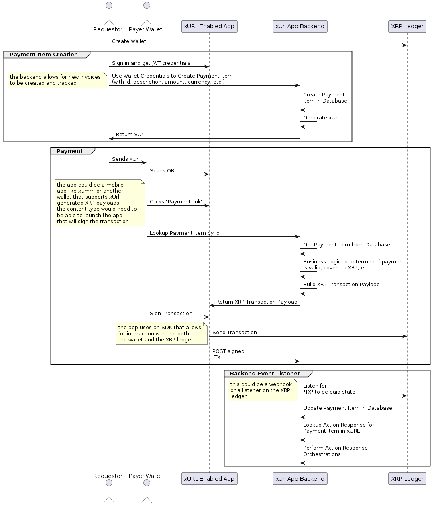

# Abstract
This proposal is a standard URI schema for generating payloads for the XRP Ledger using metadata. Its emphasis is on the encoding of URIs as "deeplinks" that can encode metadata that allow for signable payloads to be generated by a backend when clicked or scanned. These payloads would be generated "just in time" by a server side response to the URI that may apply business logic when generating the payload. This proposal is a metadata taxonomy for generating payloads and is designed to be extensible and flexible, and to be used in a variety of contexts.

# 1. Introduction
Making a payment is a common task for all of us, and making payment easy for users is a key goal for any payment network. The key challenge is to make the payment process as frictionless as possible for all users in the ecosystem on **both sides of the transaction**. The xURL protocol is intended for the XRP payment ecosystem and aims to make the payment process require less two party participation create the possibilities for new UX use cases. 

By abstracting and separating the activities of creating payment requests and automating the generation of payment payloads using a "just in time" backend we propose opens up a number of powerful use cases.

**NOTE:** The main goal of this proposal is specifically to provide a taxonomy and standardization of the URI schema for "implicit" backend payload generation and is not intended for "explicit" URI payload encoding. 

## 1.1 Context Example
A user wants to make a payment to a merchant. The merchant has a QR code that encodes a URI that contains the metadata related to a payment request for an item in their inventory. The merchant has printed the QR code onto a card, with a USD cost that people who want to purchase the item using XRP "scan to buy". The user scans the QR code with their mobile wallet and the wallet opens the URI and generates a payment payload based the payment item information on the backend database. The backend generates the payment payload and returns it to the wallet. The wallet then signs the transaction and submits it to the XRP Ledger.

## 1.2 Problem/Solution
Commonly in payment transactions a two party solution is required. One party may use a point of sale system that can implement any required business logic and generate a payment payload. The other party may use a mobile wallet that can sign the transaction and submit it to the XRP Ledger. This is a common pattern for many payment systems today.

Taking this approach means that two parties must be involved to essentially coordinate purchases. This is a impactful limitation for many use cases, especially in the B2B space where the buyer and seller may not have a direct relationship or may not have a direct line of communication. This is necessary because the buyer must initiate the payment and the seller must generate the payment payload based on the facts on the ground at the time of the transaction. Considerations such as inventory, shipping, and fulfillment, and currency conversion all must be taken into account when generating the payment.

The solution is to create a URI schema that can encode the metadata for a payment request and can be used to generate the payment payload on the backend using pre-defined business rules at the moment when its needed. This allows the buyer to initiate the payment and the seller's backend to automate the fulfillment the payment request with all of the business logic required to fulfill the request executed when the transaction is signed by the payer.

In this way, this specification is a standard a taxonomy for instructing a backend in *how* to generate payloads, where the payload is not created until the URI is opened by a user, and where the backend may require business logic or orchestration to generate the payload.

## 1.3 Motivation
The purpose of this standard is to create a URI schema for links and QR codes that are commonly used in making payments today. Inspiration is taken from the use cases empowered by the [Lightning Network LNURL Standard](https://github.com/lnurl/luds) as well as the [XUMM Payload Workflow](https://xumm.readme.io/docs/payload-workflow)

## 1.4 Use Cases
The xURL protocol is intended to be used in a variety of contexts. The following are some examples of use cases that are enabled by the xURL protocol.

* **Scan To Pay** - A way for merchants to create a payment request that can be fulfilled by the buyer at the time of scan, and can be converted from fiat at the time of payment. These can be used over and over by the buyer to receive goods and trigger backend fulfillment. This is ideal for B2B restocking or rental use cases.

* **On Demand Fulfillment** - A way for merchants to create a payment request that can be fulfilled by the buyer at the time of scan, and can be converted from fiat at the time of payment. These can be used over and over by the buyer to receive goods and trigger backend fulfillment. This is ideal for B2B restocking or rental use cases.

* **Asymmetric Payment Technologies** - A way for merchants to create a payment request in a printed form that can be fulfilled by the buyer at the time of scan, and doesn't require that the seller have a smart device to accept payment. Since the buyer is initiating payment, and that payment can be verified on the buyer's wallet, this can be used when the seller may not have direct access to a mobile device or computer.

## 1.4 Sequence of Events in xURL lifecycle



# 2. xURL Specification
xUrl is a URI specification to explain to a a backend on how to generate payloads. The intention is that given a URI, a backend can generate a payload that can be signed and submitted to the XRP Ledger. The URI is designed to be extensible and flexible, and to be used in a variety of contexts.

## 2.1 URI Format
The URI format is defined as follows:

```
xurl://<endpoint>/<version>/<subject>/<subjectid>?<parameters>&sig=<signature>

ie.

xurl://devapi.xurl.org/xurl/v1/paymentitem/3?qty=5


```
where:

* `https://` or `xurl://` as the protocol (https is for calling the backend directly, xurl is for calling the backend indirectly via a proxy or parsing as a client side URI)
* `<endpoint>` is the endpoint of the backend that will generate the payload
* `<version>` is the version of the xURL protocol
* `<subject>` is the **business concept object** subject of the URI, this concept will drive how the backend determines the type of payload that will be generated based on the domain model of the backend.
* `<subjectid>` is the subject ID of the URI, this will be the entity that will be used to generate the payload, this is specific to the subject chosen
* `<verb>` the verb type of the URI, this will be inform the intent of the payload, this is specific to the subject chosen and must be supported by the subject
* `<parameters>` are the parameters that will be used to generate the payload, these are specific to the subject and verb chosen. NOTE: The parameters are encoded as a query string, Using an alternative trustline is specified as a standard parameter in payment use cases. The parameters are encoded as a query string to allow for future extensibility of the protocol.
* `sig` the signature of the URI (not including the signature itself), this is used to verify the authenticity of the URI. The receiver will use the public key of the sender to verify the signature. The signature is generated by the sender using the private key of the sender. The signature is generated using the [Ed25519](https://ed25519.cr.yp.to/) algorithm.

```python
class XurlVersion(str, Enum):
    v1 = 'v1'

class NameValue(BaseModel):
    name: str
    value: str

    def __init__(self, **data: Any) -> None: 
        super().__init__(**data)
        
class XurlSubjectType(str, Enum):
    payment_item = 'paymentitem'
    order_invoice = 'orderinvoice'

class Xurl(BaseModel):
    subject_type: XurlSubjectType
    subject_id: int
    verb_type: XurlVerbType 
    parameters: Optional[list[NameValue]]   

    def __init__(self, **data: Any) -> None: 
        super().__init__(**data)
```

## 2.2 URI Endpoint
This is the deeplink endpoint of the backend that will generate the payload. This is the same endpoint that is used for the `xumm://` deeplink schema.

## 2.2 URI Version
This is the version of the xURL protocol. This is a version number that is used to identify the version of the protocol that is being used. This is used to allow for future versions of the protocol to be backwards compatible with older versions.

## 2.2 URI Subject
This is the subject of the URI, this will be the type of **business object** that will be looked up based on the domain model of the backend to determine the payload. The below entities are proposed as a starting taxonomy. This is used to allow for future versions of the protocol to be backwards compatible with older versions. The specification of the subject is defined by the backend, but there are some common subjects that are defined in this proposal.

Specified subjects:
The following subjects are defined in this document:


* `PaymentItem` - A payment item is a specific item in the inventory to be sold. This is a specific entry in the backend's inventory that can be purchased by the buyer immediately, this is the most common subject used in the xURL protocol.
* `OrderInvoice` - An order transaction. This is a preexisting order, usually including customer information in the backend, that can be fulfilled by the seller. This schema includes details around a specific order, but can also act like a template for reorders.
* `CustomerAccount` - A customer account allows a new customer to add themselves to a store as a buyer. Once added verbs can be used to create orders, payment items, etc. This is a one time use per customer account per shop.


Proposed subjects:
* `Offer` - An offer allows the wallet holder to accept or reject an offer. This is a preexisting offer, usually including customer information in the backend, that can be fulfilled by the seller. One time use.
* `Access` - Request access to a specific resource. This may be a time limited access to a resource or a one time use access to a resource.
* `TrustSet` - A trust line transaction generally this means the receiving wallet is authorizing the sending wallet to send a specific currency to the receiving wallet. This is a one time use per currency line.
* `Escrow` - Agree to an escrow transaction. This is a one time use per escrow transaction.
* `Check` - A check transaction
* `SignContract` - Sign a contract. This is a one time use per contract.

all subjects must be given an ID that is unique to the backend. This is used to identify the subject of the transaction and is the key for the backend domain lookup.

### 2.2.1 PaymentItem
This is a payment item transaction. This is a specific entry in the backend's inventory that can be purchased by the buyer immediately, this is the most common subject used in the xURL protocol.

Given the xumm deeplink schema:

`GET https://xumm.app/detect/xapp:sandbox.32849dc99872?xurl_endpoint=xurl://devapi.xurlpay.org/v1/paymentitem/3/noop?qty=3`

**Subject Behavior:**
The xurl backend looks up the payment item schema:

```python
class XurlVerbType(str, Enum):
    buy_now = 'buynow'
    noop = 'noop'

class InventoryItem(BaseModel):
    id: int
    user_id: int
    name: str
    description: str
    sku_id: Optional[str]
    images: Optional[list[Image]]
    in_stock: int
    on_backorder: int

class PaymentItem(BaseModel):
    id: int
    user_id: int 
    inventory_item: InventoryItem
    i8n_price: float
    i8n_currency: str
    in_shop: bool
    verb_type: XurlVerbType
    xurl: URI
```

and the serialized version:

```json
{
    "id": 3,
    "user_id": 1,
    "inventory_item": {
        "id": 3,
        "user_id": 1,
        "name": "Tootsie Roll Chocolate Midgees",
        "description": "Tootsie Roll Chocolatey Twist Midgees Resealable Standup Bag, Peanut Free, Gluten Free original, Allergy Friendly, Mini Midgees",
        "sku_id": "bd209ac51b",
        "images": [{
            "id": 3,
            "data_url": "https://s3.us-west-2.amazonaws.com/dev.xurlpay.org/uploaded_images/65c74114-c2c9-444b-9c6f-a579123fa77e.png"
        }]
    },
    "verb_type": "buynow",
    "i8n_price": 1.19,
    "i8n_currency": "USD",
    "in_shop": true
}
```

The backend will use the `subject` and `subjectid` path attributes to lookup the payment item in the backend and will use the `i8n_price` and `i8n_currency` fields to determine the amount of the transaction in XRP. While any currency conversion is allowed and can be performed by the backend, it is recommended that only currencies supported by the XRP sdk are used to provide consistency in conversion rates. Also see the section on Trustline parameters for payment use cases involving currencies other than XRP.

**Parameter Behavior:**
* `qty` - If there is a qty parameter, the backend will multiply the `i8n_price` by the qty parameter to determine the total amount of the transaction.
* `currency` - The expectation of the currency paramater is that the backend will use the currency parameter to determine the amount of the transaction in the target currency to be used for payment. The backend will use the XRP sdk to convert the `i8n_price` to the currency value and there is an expected conversion rate that needs to be available for this to occur. Validation that the trustline exists is also required used by the payer_account param.
* `payer_account` - The payer_account parameter is used to allow for the use of an alternative trustline. Trustlines are checked for currency conversion.

See [XRP Currency Codes](https://xrpl.org/currency-formats.html#currency-codes) for a list of supported currencies.

**Generated Payload:**

```json
{
  "txjson": {
    "TransactionType": "Payment",
    "Destination": "rhcEvK2vuWNw5mvm3JQotG6siMw1iGde1Y",
    "Amount": "2784023",
    "Memos":[
        {"content-type":"application/json", "value":{"subject": "PaymentItem", "body": {"id": "3", "qty": "3", "payload_id": "payment_item:Sw67XjAf2kAt"}}},
        {"content-type":"application/json", "value":{"verb": "BuyNow", "context": {"subject": "PaymentItem"}}}
    ]
  },
  "custom_meta": {
    "identifier": "payment_item:Sw67XjAf2kAt",
    "blob": "{\"type\": \"payment_item\", \"payment_item_id\": 3, \"xrp_quote\": 0.377152, \"fiat_i8n_currency\": \"USD\", \"fiat_i8n_price\": 0.21, \"request_hash\": \"HaziBd3faamgNcS8EsjzuX\", \"network_endpoint\": \"https://s.altnet.rippletest.net:51234/\", \"network_type\": \"testnet\", \"qty\": 5}",
    "instruction": "Pay 0.21 USD each for 5 Tootsie Roll Chocolate Midgees"
  }
}
```

### 2.2.2 OrderInvoice
```python
class PaymentItemLine(BaseModel):
    id: int
    qty: int
    payment_item: PaymentItem

class Address(BaseModel):
    id: int
    user_id: int
    name: str
    address: str
    city: str
    state: str
    zip: str
    country: str

class CustomerAccount(BaseModel):
    id: int
    name: str
    order_address: Address

class OrderInvoice(BaseModel):
    id: int
    user_id: int 
    name: str
    description: str
    order_item_lines: list[OrderItemLine]
    order_customer: OrderCustomer
    trustline: Optional[TrustlineConversion]
    allow_partial_payment: bool
    allow_partial_shipment: bool
    allow_reorder: bool
    verb_type: XurlVerbType

class OrderItemLine(BaseModel):
    id: int
    user_id: int 
    order_item: OrderItem
    qty: int

class OrderItem(BaseModel):
    id: int
    user_id: int 
    inventory_item: InventoryItem
    i8n_price: float
    i8n_currency: str
    in_shop: bool
    
```
and the serialized version:

```json
{
    "id": 3,
    "user_id": 1,
    "name": "Monthly Reorder List",
    "description": "List of items to reorder monthly",
    "trustline": {
        "token_currency": "USD",
        "issuerAccount": "rswCmDnJw4hTuvPV9fnJWYKGcGydkwwhtG"     
    },
    "payment_item_lines": [
        {
            "id": 3,
            "qty": 3,
            "payment_item": {
                "id": 3,
                "user_id": 1,
                "images": [{
                    "id": 3,
                    "data_url": "https://s3.us-west-2.amazonaws.com/dev.xurlpay.org/uploaded_images/65c74114-c2c9-444b-9c6f-a579123fa77e.png"
                }],
                "name": "Tootsie Roll Chocolate Midgees",
                "description": "Tootsie Roll Chocolatey Twist Midgees Resealable Standup Bag, Peanut Free, Gluten Free original, Allergy Friendly, Mini Midgees",
                "sku_id": "bd209ac51b",
                "i8n_price": 1.19,
                "i8n_currency": "USD"
            }
        }
    ],
    "order_customer": {
        "id": 3,
        "name": "John Doe",
        "order_address": {
            "id": 3,
            "user_id": 1,
            "name": "Home",
            "address": "123 Main St",
            "city": "San Francisco",
            "state": "CA",
            "zip": "94105",
            "country": "US"
        }
    }
}
```


### 2.2.3 CustomerAccount

```python
class CustomerAccount(BaseModel):
    id: int
    name: str
    order_address: Address

```


<!-- ## 2.3 Trustlines

xURLs can specify alternative trustlines to be used for payment. This is done by specifying the `payer_account` parameter in the URI along with the desired currency to convert to for payment. 

```python
class Trustline(BaseModel):
    id: int
    token_currency: str
    issuerAccount: str
    datetime: Optional[str]
    txid: Optional[str]
    
class TrustlineConversion(BaseModel):
    id: int
    trustline: Trustline
    i8n_currency: str
    rate: float
    
```
payloads with trustlines have an alternative `Amount` field that specifies the currency and issuer of the trustline.

```json
{
  "txjson": {
    "TransactionType": "Payment",
    "Destination": "rhcEvK2vuWNw5mvm3JQotG6siMw1iGde1Y",
    "Amount": {
		"currency": "4942495358000000000000000000000000000000",
		"value": "5",
		"issuer": "rrnR8qAP8tczCbgD1gqt4RgcwTZPcSXyn2"
	},
    "Memos":[
        {"content-type":"application/json", "value":{"subject": "PaymentItem", "body": {"id": "3", "qty": "3", "payload_id": "payment_item:Sw67XjAf2kAt"}}},
        {"content-type":"application/json", "value":{"verb": "BuyNow", "context": {"subject": "PaymentItem"}}}
    ]
  },
  "custom_meta": {
    "identifier": "payment_item:Sw67XjAf2kAt",
    "blob": "{\"type\": \"payment_item\", \"payment_item_id\": 3, \"xrp_quote\": 0.377152, \"fiat_i8n_currency\": \"USD\", \"fiat_i8n_price\": 0.21, \"request_hash\": \"HaziBd3faamgNcS8EsjzuX\", \"network_endpoint\": \"https://s.altnet.rippletest.net:51234/\", \"network_type\": \"testnet\", \"qty\": 5}",
    "instruction": "Pay 0.21 USD each for 5 Tootsie Roll Chocolate Midgees"
  }
}
``` -->
